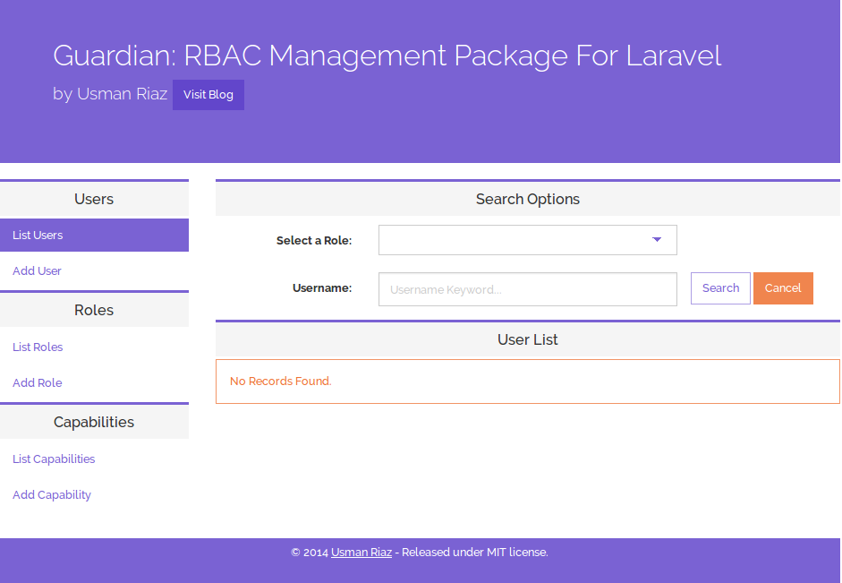

##Guardian: Role Based Access Control Package For Laravel With Backend Interface

Guardian package for Laravel provides an easy interface to manage Role Based Access Control. Through its minimalist interface you can add users, roles and capabilities. Each user can be assigned multiple roles (many to many) and each role can be assigned multiple capabilities.

Guardian also comes with plenty of Access Control helper methods that make it easy to track access for a specific user inside your code.


##Installation and Setup

To install guardian, add the following lines in your `composer.json` file:
	
	"require-dev": {
		"usm4n/guardian": "dev-master"
	}

After adding the above lines, save the file and run:
	
    composer update --dev

After the successful completion of the composer installation process, add the following line to the `providers` array inside the `app/config/app.php` file:

	'Usman\Guardian\GuardianServiceProvider'

###Running Package Migrations

To setup the database for the guardian, you will need to run the following command to run the package migration files:

	artisan migrate --package="usm4n/guardian"

###Publishing Assets

Run the following `artisan` command to publish the package assets in `public` directory of your Laravel installation:

	artisan asset:publish 'usm4n/guardian'

###Model Setup

Guardian requires you to have the following models inside your models directory: `User`, `Role` and `Capability`.

app/models/Role.php

```php
<?php

class Role extends Eloquent {
	
	public function users() 
	{
		return $this->belongsToMany('User');
	}

	public function capabilities()
	{
		return $this->belongsToMany('Capability');
	}
	
}
```
app/models/Capability.php

```php
<?php

class Capability extends Eloquent {
	
	public function roles()
	{
		return $this->belongsToMany('Role');
	}
}
```
The `User` model will require the following changes:

```php
...
use Usman\Guardian\AccessControl\AccessControlTrait;
use Usman\Guardian\AccessControl\AccessControlInterface;

class User extends Eloquent implements UserInterface, RemindableInterface, AccessControlInterface {

	use UserTrait, RemindableTrait, AccessControlTrait;
	...
}
```

> Please note that, if you want to place your model classes inside a custom `namespace`, reflect the changes in the package `config.php` file.

vendor/usm4n/guardian/src/config/config.php

```php
<?php
return [
    'userModel' => '\User',
    'roleModel' => '\Role',
    'capabilityModel' => '\Capability',
];
```
After making the requested changes you will be able to access the guardian backend at `http://www.yoursite.com/guardian/backend`. The `auth` filter is applied by default. So, you will need to log in first.

> In a development/local environment you can remove the `'before'=>'auth'` key value pair from the package's `routes.php` file for a test drive.



##Guardian Helpers

The following helper methods are available through `Guardian` Facade:

- `Guardian::hasRole($roleName)` - returns true if the current user has the role otherwise false will be returned.
- `Guardian::hasAnyRole(array $roleNames)` - returns true if user has any of the supplied roles otherwise false will be returned.
- `Guardian::hasAllRoles(array $rolesNames)` - returns true only if user has all the supplied roles otherwise false will be returned.
- `Guardian::hasCapability($capabilityName)` - returns true if the user has the supplied capability otherwise false will be returned.
- `Guardian::hasAnyCapability($capabilityNames)` - returns true if the user has any of the supplied capabilities otherwise false will be returned.
- `Guardian::hasAllCapabilities($capabilityNames)` - returns true if the user has all the supplied capabilities otherwise false will be returned.

##Help Resources For Laravel

- [Laravel docs](http://laravel.com/docs)
- [LaraCasts](https://laracasts.com/)
- [Laravel forum](http://laravel.io/forum)
- [Laravel Reddit](http://www.reddit.com/r/laravel/)

##Acknowledgements

- [Selectize.js](http://brianreavis.github.io/selectize.js/)
- [divshot/bootstrap-theme-white-plum](https://github.com/divshot/bootstrap-theme-white-plum)

##License

Guardian is a free software released under the terms of the MIT license.

##To-do list

- Code documentation.